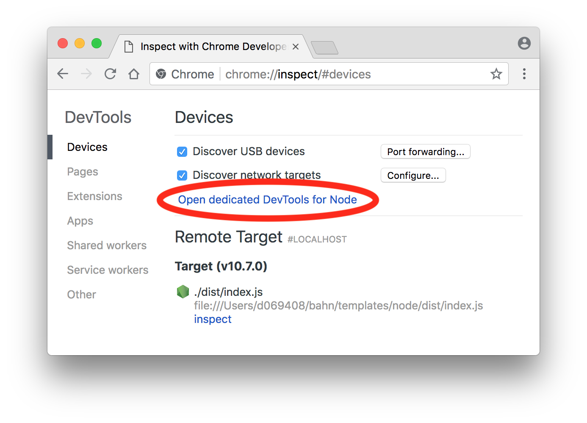
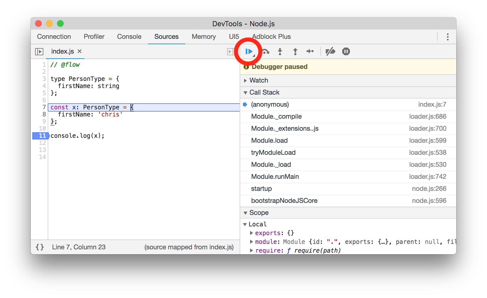
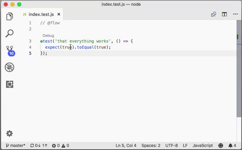

<p align="center"></p>

<h1>A Node.js Starter Project Template</h1>

If you use *nodejs-template* as a starting point for new Node.js projects you will get:

<table>
  <tbody>
	  <tr><td>✅</td><td><a href="#custom-module-aliases">Custom Module Aliases</a></td></tr>
    <tr><td>✅</td><td>Type checks (optional) using <a href="https://flow.org">Flow</a>.</td></tr>
    <tr><td>✅</td><td>Unit Tests (optional) using <a href="https://jestjs.io/">Jest</a>.</td></tr>
    <tr><td>✅</td><td>Basic <a href="https://babeljs.io/">Babel</a> Configuration</td></tr>
    <tr><td>✅</td><td>Basic <a href="https://eslint.org/">ESLint</a> Configuration</td></tr>
    <tr><td>✅</td><td>Plays well with <a href="https://code.visualstudio.com/">Visual Studio Code</a>.</td></tr>
    <tr><td>✅</td><td>Useful npm Scripts.</td></tr>
    <tr><td>✅</td><td>A helpful <code>README</code> to get you started.</td></tr>
  </tbody>
</table>

---

**Table of Contents**

* [Getting Started](#getting-started)
* [Changelog](#changelog)
* [Compiling](#compiling)
* [Running](#running)
	* [Running from command line](#running-from-command-line)
	* [Running from Visual Studio Code](#running-from-visual-studio-code)
* [Debugging](#debugging)
	* [Debugging with Chrome DevTools](#debugging-with-chrome-devtools)
	* [Debugging with Visual Studio Code](#debugging-with-visual-studio-code)
* [Testing](#testing)
* [Custom Module Aliases](#custom-module-aliases)
* [What is this?](#what-is-this)
* [Future](#future)

---

## Getting Started
Using this template is easy:

```
$ git clone https://github.com/ChristianKienle/nodejs-template.git myproject
$ rm -rf myproject/.git
$ cd myproject
$ npm install && npm run build && npm run start
```

You can edit `package.json` accordingly and adapt the template to your needs.

## Changelog

### v.1.0.1 (2018-08-06)
* **NEW** – [Custom Module Aliases](#custom-module-aliases): `require('@lib')` vs. `require('./../../../../../lib')`.
* **NEW** – npm scripts: `lint` and `lint:fix`.
* **FIX** – Enabled ESLint for config files.
* Relaxed flow linting rules a little. 

## Compiling
Since this template is using [Flow](https://flow.org) (for type checking) the code has to be compiled before it can be executed. However, compiling is optional if you are:

- not using Flow at all or if you are
- only using Flows [comment-based syntax](https://flow.org/en/docs/types/comments/).

Personally I like the comment-based syntax very much. It definitely has several benefits: You obviously don't have this extra compile step and thus makes adoption easier. Personally I usually start by using the comment-based syntax and then later on I switch to Flows full blown feature set. There are two npm-build-scripts:

```
npm run build
```

This runs a one-off compilation. In contrast:

```
npm run build:watch
```

is watching `./src` for changes and automatically runs the compiler once a change is detected. In both cases the compiled code is written to `./dist` (alonside with source maps).

## Running

### Running from command line
There are multiple ways to execute and debug the code. The most basic one is to use the predefined npm-scripts. Execute the `start`-script in order to simply start the execution:

```
npm run start
```

There is also a debug version of the `start`-script available:

```
npm run start:debug
```

The `start:debug`-script does the same as the `start`-script but halts execution until a debugger is attached. There are multiple ways to attach a debugger to the waiting Node process. More about that later.

### Running from Visual Studio Code
This template comes with a Visual Studio Code launch configuration (called *Launch*) which you can use to start execution. If you are using the *Launch* configuration then you **don't** have to compile anything beforehand because it is done automatically.

## Debugging
### Debugging with Chrome DevTools
Simply execute `start:debug` as described above and then launch Chrome and open [chrome://inspect](chrome://inspect). You should see something like this:



Launch the debugger by clicking on the circled link. This should open the debugger.



You can now add breakpoints, watch expression (...). Once you are ready click on `Resume` (circled in red).

### Debugging with Visual Studio Code
If you use the *Launch* launch configuration breakpoints in Visual Studio Code should work out of the box. You can also use the *auto attach* feature of Visual Studio Code.

- Make sure that *auto attach* is **on**.
  - If you fail to end up in your debugger *auto attach* may be disabled.
  - In that case you can try to *toggle auto attach*.
  - Open the command palette ⇧⌘P (macOS).
  - Execute the *toggle auto attach* command.
  - Try again.
- Then you can use the integrated terminal and execute the `start:debug`-script.
- You should also end up in your debugger if a breakpoint is hit. Magic!


## Testing
Because testing should be delightful this template is using [Jest](https://jestjs.io/). You can run tests via npm:

```
$ npm test
```

**or**

```
$ npm run test:watch
```

The latter command will execute all tests automatically whenever a change is detected.

---
**NOTE**

If you are using Visual Studio Code executing `npm run test:watch` is usually not needed. Visual Studio Code provides live feedback already.



---

You can also start an individual test in Visual Studio Code. Above each test there is a `Debug`-button. Click that and only the corresponding test will be executed.

A few notes about testing and this template:

- There is a sample test (`./src/sample.test.js`).
- You may have to install the [Jest Visual Studio Code extension](https://marketplace.visualstudio.com/items?itemName=Orta.vscode-jest) in order to get all the benefits from Jest + Visual Studio Code.
- Type checking using Flow should work in tests (Jest type annotations are installed and enabled)
- ESLint is configured to ignore type definitions installed via *flow-typed* (subfolder: *npm*).
- Files matching `src/**/*.test.js` will be executed by Jest.

## Custom Module Aliases
You can easily define custom module aliases. A custom module alias allows you to replace relative imports/requires like `require('./../../../../../lib')` with just `require('@lib')`.

In face, this template project comes with a single preconfigured module alias: `@lib`. Everything inside the `src/lib` folder can be imported by using `@lib`. 

**Creating a custom module alias:**

In order to create a custom module alias called `@utils` you have to:

<strong>1. Create a new directory</strong>

```
$ mkdir ./src/utils
```

<strong>2. Add the alias to `.babelrc.js`</strong>

```
…
const plugins = [
  ['module-resolver', {
    'root': ['./src'],
    'alias': {
     '@lib': './src/lib',
     '@utils': './src/utils',
//    ^
//    ^___ this is your new alias
    }
  }]
];
…
```

<strong>3. Add the alias to `./src/.flowconfig`</strong> (optional)

```
…
[options]
…
module.name_mapper='^@utils$' -> '<PROJECT_ROOT>/utils/'
module.name_mapper='^@utils\/\(.*\)$' -> '<PROJECT_ROOT>/utils/\1'
…
```


## What is this?
It is being said that getting into JavaScript development is easy. This may be true. The language it very forgiving (wat?) and (compared to many other languages) has very few key concepts (which is a good thing IMHO. Writing the first 100 lines of JavaScript code is easy. However, without any tooling writing more code than that quickly becomes unmanageable. Fortunately there are many tools that make it a joy to write more than 100 lines of JavaScript. Unfortunately setting those tools up can be frustrating. It is usually a mix of trial and error with a lot of reading in-between. This repository contains a very basic project template that can be used as a basis for new Node.js projects. If you use this template as a starting point you get the following things (preconfigured):

- Linting (using ESLint): Enforces a consistent code style and (more importantly) enforces best practices. 
- Type checking (using Flow; optional): To catch type/null errors and for auto completion.
- Testing (using Jest; optional)
- Multiple ways to debug your code (using Chrome DevTools and Visual Studio Code)

This template is merely a composition of existing tools and a hopefully helpful Readme. It tries to include the least amount of stuff but, at the same time, provide the maximum benefit. Everything in this template is optional. For example: If you don't like type checks simply remove `.src/.flowconfig`. If you don't like testing your code simply remove the sample test. If you want type checks but hate an extra compile step simply use comment-based type annotations. If you hate Visual Studio Code simply remove the `.vscode` folder.

## Future
To me *nodejs-template* is the basis for a developer tool which will be able to generate new projects. Think of it as a combination of [Yeoman](http://yeoman.io/) and Vue CLI.
